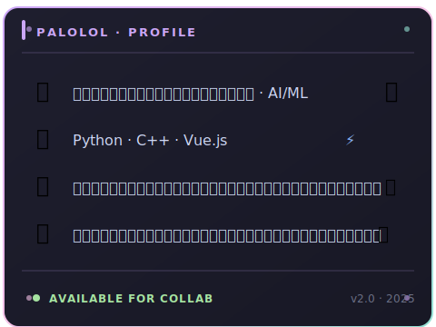

<div align="center">

<!-- ANIMATED BANNER -->


<br/>

<!-- TYPING ANIMATION -->


<br/>

<!-- ANIMATED PROFILE VIEWS -->

&nbsp;

&nbsp;


</div>

---


<div align="center">

<!-- Profile card (rendered as SVG so GitHub's HTML sanitizer doesn't strip the styles) -->


<br/><br/>

| | 🌱 **កំពុងរៀន** | 🛠️ **កំពុងសាងសង់** | 🎯 **គោលដៅ** |
|:-:|:---|:---|:---|
| 1 | Deep Learning & LLMs | ម៉ូដែល AI/ML | ការស្រាវជ្រាវ AI |
| 2 | Computer Vision | ប្រព័ន្ធជំនាញ | ប្រភពបើកចំហ |
| 3 | Mobile Dev (Flutter) | គម្រោងផតហ្វូលីយ៉ូ | ផលប៉ះពាល់ |

<p>
  
  
  
</p>

</div>

---

## ⚡ បច្ចេកវិទ្យាដែលប្រើ (ជាមួយចលនា)

<p align="center">
  
  
  
  
  
  
  
  
  
  
  
  
</p>

<p align="center">
  
  
  
  
  
</p>

---

## 🎬 ការបង្ហាញពិសេសជាមួយចលនា

<div align="center">

<!-- THE ANIMATED DOWNLOAD.GIF — referenced via the local file path so GitHub renders it inline -->


<br/>

### ✨ *ការមើលផ្ទាល់ — មកពីការសាងសង់របស់ខ្ញុំ* ✨

</div>

> 🔗 **ប្រភពទ្រព្យសម្បត្តិ:** [Steam UGC mirror](https://images.steamusercontent.com/ugc/799867431808682621/1B94857CB0F1F3ADFDC3FF8D6027DD448F565ED9/?imw=5000&imh=5000&ima=fit&impolicy=Letterbox&imcolor=%23000000&letterbox=false) — ឆ្លុះក្នុងស្រុកជា `download.gif` សម្រាប់ការបង្ហាញ GitHub លឿន។

---

## 🚀 គម្រោងពិសេសៗ

<table align="center">
<tr>
<td width="50%" valign="top">

### 🍅 ប្រព័ន្ធជំនាញធ្វើរោគវិនិច្ឆ័យប៉េមូតាតូ
**វគ្គសិក្សា AI របស់សាកលវិទ្យាល័យ · 2023**

ប្រព័ន្ធជំនាញដែលធ្វើរោគវិនិច្ឆ័យជំងឺរុក្ខជាតិប៉េមូតាតូពីរោគសញ្ញានិងច្បាប់។

```yaml
stack: [Python, Prolog]
type:   ប្រព័ន្ធជំនាញផ្អែកលើច្បាប់
status: ✅ បានបញ្ចប់
```

</td>
<td width="50%" valign="top">

### 📱 ការដឹកជញ្ជូនអាហារតាមទូរស័ព្ទ
**គម្រោងសាកលវិទ្យាល័យ · 2023–2024**

កម្មវិធីទូរស័ព្ទបញ្ជាទិញនិងដឹកជញ្ជូនអាហារពេញលេញ។

```yaml
stack: [Flutter, Dart, Firebase]
type:   កម្មវិធីទូរស័ព្ទ
status: ✅ បានបញ្ចប់
```

</td>
</tr>
<tr>
<td width="50%" valign="top">

### 🧠 ម៉ូដែល AI លើកុំព្យូទ័រយួរដៃ
**សិក្សាដោយខ្លួនឯង · 2024–បច្ចុប្បន្ន**

បណ្តុំផ្ទាល់ខ្លួននៃម៉ូដែល ML/DL — ការចាត់ថ្នាក់រូបភាព, NLP, ការពិសោធន៍ — ទាំងអស់បង្វឹកក្នុងស្រុក។

```yaml
stack: [Python, PyTorch, TF, Jupyter]
type:   ការពិសោធន៍ ML / DL
status: 🔄 កំពុងដំណើរការ
```

</td>
<td width="50%" valign="top">

### 🌐 ផតហ្វូលីយ៉ូ v2 (គេហទំព័រនេះ!)
**គម្រោងបច្ចុប្បន្ន · 2025**

ផតហ្វូលីយ៉ូ Vue 3 ដែលអ្នកកំពុងមើលឥឡូវនេះ។

```yaml
stack: [Vue.js, CSS, JS]
type:   ផតហ្វូលីយ៉ូ
status: ✅ កំពុងដំណើរការ
```

</td>
</tr>
</table>

---

## 📊 ស្ថិតិ GitHub — ផ្ទាល់

<div align="center">

<!-- Self-hosted stats (github-readme-stats vercel deployment is paused) -->

&nbsp;&nbsp;


<br/><br/>

<!-- Streak stats (migrated from dead herokuapp endpoint to the Vercel-hosted demolab fork) -->


<br/><br/>

<!-- Contribution Graph (vercel service still works) -->


</div>

---

## 🐍 ពស់ចូលរួម — មានចលនា

<div align="center">


</div>

---

## 🏆 សមិទ្ធិផល

<div align="center">

| | សមិទ្ធិផល | ស្ថានភាព |
|:-:|:---|:---:|
| 🐍 | ស្គ្រីប Python ដំបូង | ✅ |
| 🍅 | បានដាក់ឱ្យដំណើរការប្រព័ន្ធជំនាញប៉េមូតាតូ | ✅ |
| 📱 | កម្មវិធីទូរស័ព្ទកំពុងផលិត | ✅ |
| 🤖 | បានបង្វឹកម៉ូដែល ML ដំបូង | ✅ |
| 🧠 | បានដាក់ឱ្យដំណើរការផតហ្វូលីយ៉ូ v2 | ✅ |
| 🎓 | វគ្គសិក្សា AI របស់សាកលវិទ្យាល័យបានបញ្ចប់ | ✅ |
| 🌐 | ផតហ្វូលីយ៉ូដែនផ្ទាល់ខ្លួន | 🔄 |
| 📚 | បានបោះពុម្ពក្រដាសស្រាវជ្រាវ | 🎯 |

</div>

---

## 📈 WakaTime — ស្ថិតិសរសេរកូដផ្ទាល់

<div align="center">


</div>

---

## ⌨️ Monkeytype — ស្ថិតិវាយផ្ទាល់

<div align="center">

<!-- Self-hosted Monkeytype stats (api.monkeytype.com, rendered daily by .github/workflows/monkeytype.yml) -->


</div>

---

## 🎧 កំពុងលេងឥឡូវ / កំពុងរីករាយ

```text
🎵 ចង្វាម Lo-fi និងសំឡេងកង្ហារកុំព្យូទ័រយួរដៃកំពុងបង្វឹកម៉ូដែល
```

---

## 📫 តោះភ្ជាប់ទាក់ទង

<div align="center">

<a href="https://t.me/palolol" target="_blank">
  
</a>
&nbsp;
<a href="mailto:palolol1165@gmail.com">
  
</a>
&nbsp;
<a href="https://github.com/Palolol" target="_blank">
  
</a>

</div>

<br/>

---

<div align="center">

<div align="center">
  
</div>

<!-- FOOTER WAVE -->


</div>
